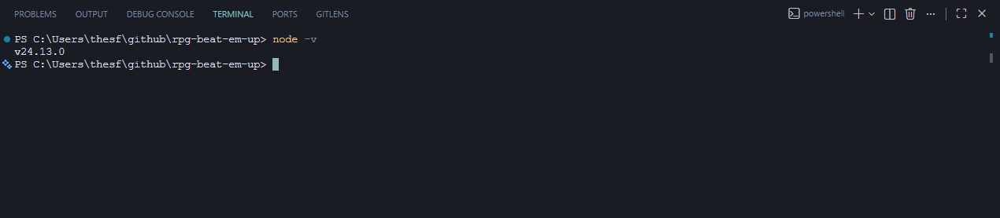

# COMPILING Operation `Byte_Brawler`
This document will guide you step-by-step on how to compile **OBB** for local development.

## Requirements
Before you begin, make sure you have these things first.
- **[Node.js](https://nodejs.org/en/download)**
- **[Included Dependencies](#included-dependencies)**

## Installation Steps
### 1. Check your node version
You have to make sure Node is installed correctly. Open your terminal (**Command Prompt**, **Powershell**, or **Bash**) and type:
```bash
node -v
npm -v
```
You should see some version numbers pop up. If you do, you're good to go.

### Example:


### 2. Navigate your project
Your terminal needs to know exactly where your game files are located. Use the `cd` (change directory) command to point to the games folder.

**Example**:
```bash
cd C:\Users\YOURNAME\Documents\OPERATION_BYTE_BRAWLER
```
### 3. Install your packages
Now we need to install the "Project Dependencies" we mentioned in the requirements. In your terminal, run:

```bash
npm install
```
This might take a minute. It's reading the project files and taking each API and dependency the game needs from the web.
> **Pro Tip:**
> If you ever notice a specific feature isnt working because a package is missing, you can manually install it by typing:
> **`npm install <package-name>` (e.g., `npm install vite`)**

#### Included Dependencies:
`@eslint/js`, `@types/react`, `@types/react-dom`, `@vitejs/plugin-react`, `eslint`, `eslint-plugin-react-hooks`, `eslint-plugin-react-refresh`, `globals`, `vite`

## Compiling
Once the installation is complete, your game is ready to go live!
Run the following commands:
- `npm run build`
     - To compile everything into a `dist` folder for better performance.
- `npm run preview`
     - To test the build. It will run a local server specifically from your `dist` folder.
- `npm run dev`
     - To program while the game runs. This build flag features an **HMR (Hot Module Replacement)**, which will automatically refresh the game everytime you make changes in your code.